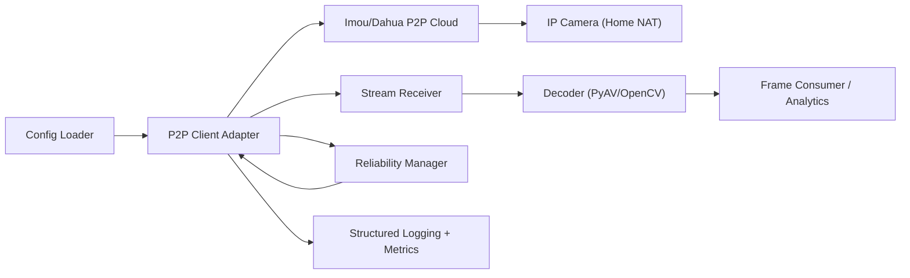
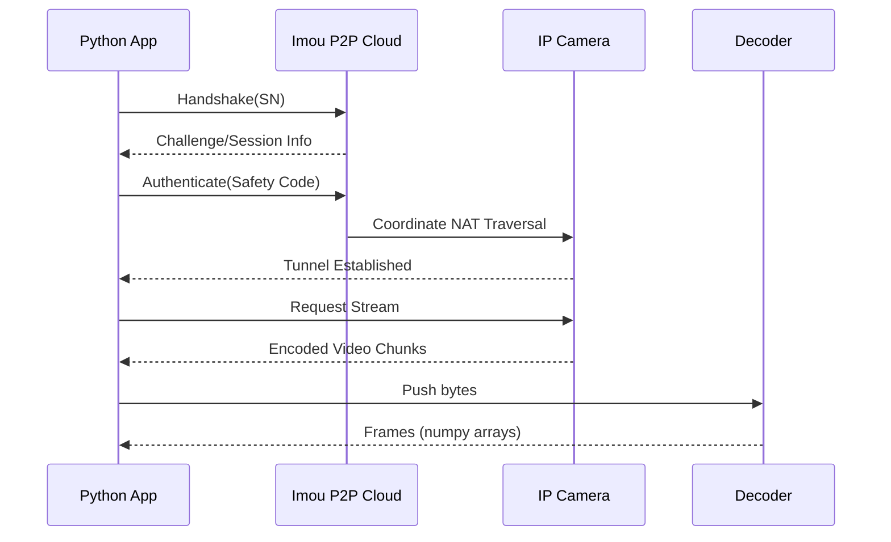
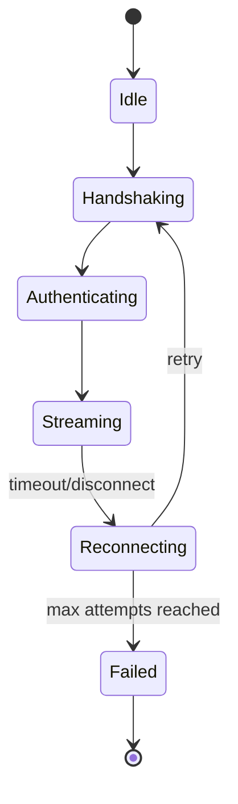

# UML Diagrams (Phase 1)

## 1) Component Diagram

```mermaid
flowchart LR
    A["Config Loader"] --> B["P2P Client Adapter"]
    B --> C["Imou/Dahua P2P Cloud"]
    C --> D["IP Camera (Home NAT)"]
    B --> E["Stream Receiver"]
    E --> F["Decoder (PyAV/OpenCV)"]
    F --> G["Frame Consumer / Analytics"]
    B --> H["Reliability Manager"]
    H --> B
    B --> I["Structured Logging + Metrics"]
```

## 2) Sequence Diagram (Happy Path)

```mermaid
sequenceDiagram
    participant App as Python App
    participant P2P as Imou P2P Cloud
    participant Cam as IP Camera
    participant Dec as Decoder

    App->>P2P: Handshake(SN)
    P2P-->>App: Challenge/Session Info
    App->>P2P: Authenticate(Safety Code)
    P2P->>Cam: Coordinate NAT Traversal
    Cam-->>App: Tunnel Established
    App->>Cam: Request Stream
    Cam-->>App: Encoded Video Chunks
    App->>Dec: Push bytes
    Dec-->>App: Frames (numpy arrays)
```

## 3) State Diagram (Connection Lifecycle)

```mermaid
stateDiagram-v2
    [*] --> Idle
    Idle --> Handshaking
    Handshaking --> Authenticating
    Authenticating --> Streaming
    Streaming --> Reconnecting: timeout/disconnect
    Reconnecting --> Handshaking: retry
    Reconnecting --> Failed: max attempts reached
    Failed --> [*]
```

