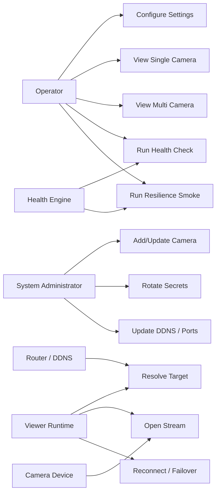
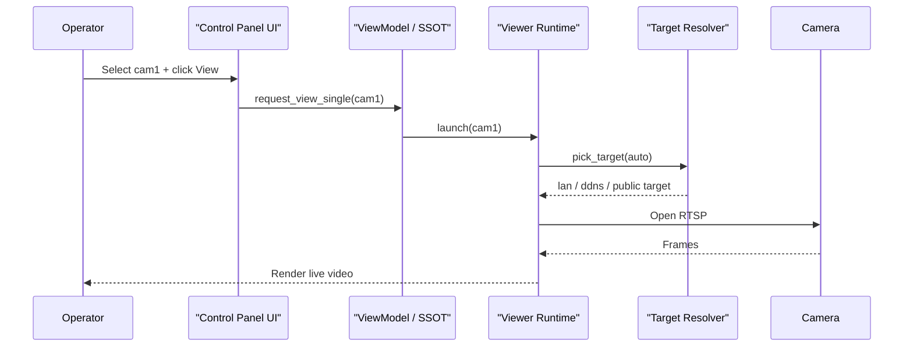
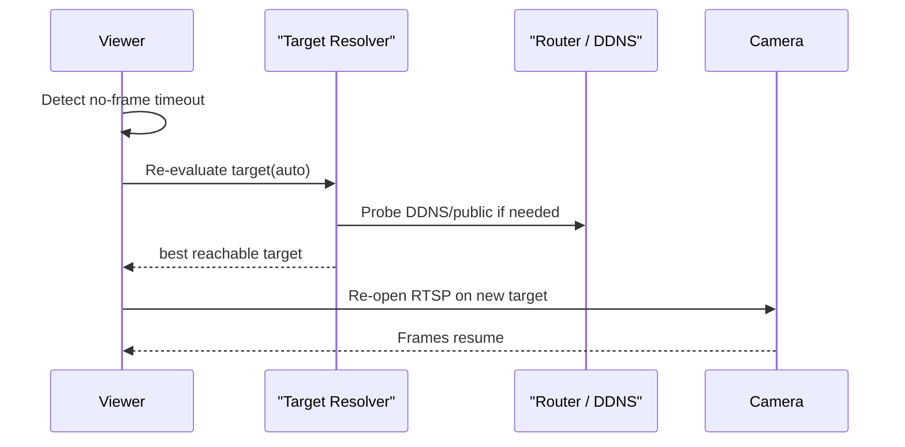
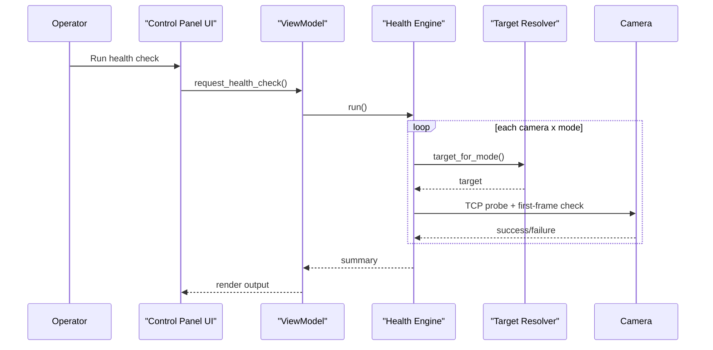
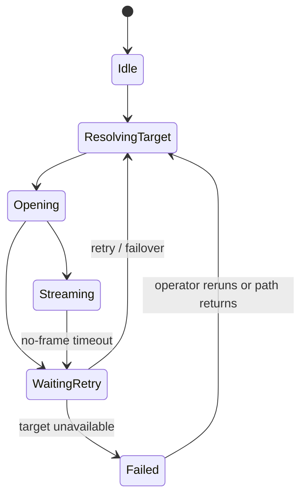

# Actors, Use Cases, and Sequence Flows

## Actors

1. **Operator**
   - launches viewers
   - changes runtime settings
   - runs health and resilience checks

2. **System Administrator**
   - updates `cameras.json`
   - manages password and DDNS configuration
   - validates rollout for new cameras

3. **Viewer Runtime**
   - opens RTSP sessions
   - reconnects after no-frame events
   - fails over between `LAN`, `DDNS`, and `public`

4. **Camera Device**
   - provides RTSP stream
   - may be reachable via LAN and/or WAN path

5. **Home Router / DDNS**
   - forwards public ports
   - resolves DDNS hostname

6. **Health/Resilience Engine**
   - validates path reachability
   - validates first-frame acquisition

## Use Cases By Actor

### Operator

- Configure local operator settings
- View one camera
- View multiple cameras
- Run health check
- Run resilience smoke check
- Inspect logs and README

### System Administrator

- Add a new camera
- Enable/disable a camera
- Rotate credentials
- Update DDNS hostname
- Verify rollout after topology change

### Viewer Runtime

- Resolve best target
- Open RTSP session
- Detect stalled stream
- Reconnect
- Fail over to another reachable target

## Use Case Diagram

## Sequence: View Single Camera

## Sequence: Reconnect With Failover

## Sequence: Health Check

## Runtime State Diagram

