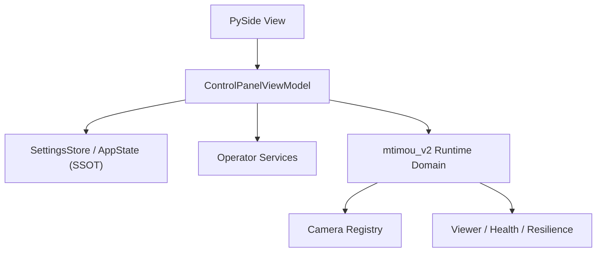

# UI Architecture: MVVM + SSOT

## Goals

- easier to understand
- easier to extend for `N` cameras
- UI code should not own business logic
- one source of truth for operator settings and camera list state

## Pattern Choice

- **View**: PySide widgets only
- **ViewModel**: presentation logic, commands, derived labels
- **Store / SSOT**: current operator settings and camera-derived rows
- **Services**: filesystem, process launch, OS integrations

## Layers

## SSOT

The control panel should use one in-memory state object:

- target mode
- DDNS host
- username
- per-camera password entries
- camera list rows
- output/log text

This prevents duplicate state living in:

- widget values
- ad hoc `dict`s
- environment side effects

## View Responsibilities

- render fields
- collect user interaction
- display results
- no knowledge of batch syntax or launch rules

## ViewModel Responsibilities

- load state from store
- map camera configs to display rows
- validate save payloads
- decide single vs multi launch action
- expose command outputs back to view

## Store Responsibilities

- parse `camera.env.bat`
- write `camera.env.bat`
- preserve comments/line order when possible
- provide structured state to the ViewModel

## Migration Path

1. create SSOT data structures
2. move env parsing/writing into a store
3. move launch/readme/log actions into services
4. let `control_panel.py` become a thinner View
5. later split the View into smaller widgets/tabs

## Recommended Next UI Steps

1. `Camera Management` tab
2. health/result status badges
3. structured log panel with severity colors
4. setup wizard for DDNS / new camera rollout
