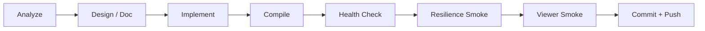

# Robustness and Process Engineering

## Engineering Principles

1. **Safe change over clever change**
2. **One moving part at a time**
3. **Verification before confidence**
4. **Operational runbooks are part of the product**

## Quality Gates

Every production change should pass:

1. `.venv` compile check
2. `run_system_health_check.bat`
3. `run_resilience_smoke.bat`
4. short single-view smoke
5. short multi-view smoke

## Change Workflow

## Failure Classes

### Class A: Configuration Failures

- missing password
- wrong DDNS hostname
- wrong camera IP

### Class B: Reachability Failures

- LAN path unavailable
- public port closed
- DNS unresolved

### Class C: Stream Failures

- RTSP open fail
- first frame timeout
- no-frame stall

### Class D: Operational Failures

- router reboot
- ISP public IP change
- DDNS lag

## Runtime Resilience Policy

1. detect no-frame condition
2. attempt reconnect
3. re-evaluate best target when in `auto`
4. continue if another path is reachable
5. expose result in logs/UI

## Observability

At minimum keep:

- health-check summary
- resilience smoke summary
- viewer summary on exit
- reconnect count
- failover count

## Honest Constraint

Current production runtime is improved and structured, but not yet:

- process-isolated per camera
- long-chaos certified
- fully migrated to MVVM in the UI

That means the system is **robust for the current house-scale use case**, but
should still be evolved deliberately before claiming heavy-scale industrial
grade resilience.
