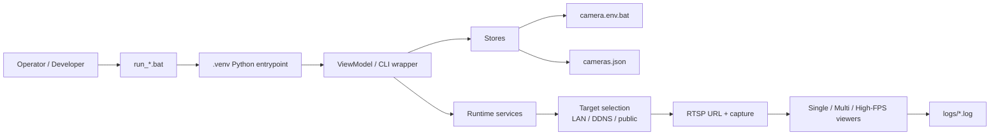

# Developer Architecture Map

This document is the one-page mental model for a developer picking up `MTImou`.

## Runtime Flow



## Main Source-of-Truth Files

### Runtime settings

- [`camera.env.bat`](../camera.env.bat)
- loaded and saved by [`src/mtimou_v2/settings_store.py`](../src/mtimou_v2/settings_store.py)

### Camera topology

- [`cameras.json`](../cameras.json)
- loaded and saved by [`src/mtimou_v2/camera_config_store.py`](../src/mtimou_v2/camera_config_store.py)

### UI state

- in-memory state lives in [`src/mtimou_v2/app_state.py`](../src/mtimou_v2/app_state.py)
- control panel orchestration lives in [`src/mtimou_v2/viewmodels/control_panel_vm.py`](../src/mtimou_v2/viewmodels/control_panel_vm.py)

## Code Ownership Map

### `src/mtimou_v2`

Owns production runtime behavior:

- config loading
- password env resolution
- target selection
- RTSP URL building
- reconnect/failover behavior
- health checks
- resilience checks
- performance checks

### `src/control_panel_app`

Owns desktop operator UX:

- layout and responsive behavior
- table filters
- action guards
- inventory editing
- settings editing
- preset workflows

### top-level `src/*.py`

Thin wrappers only:

- `run_camera_stable.py`
- `multi_camera_view.py`
- `system_health_check.py`
- `resilience_smoke.py`
- `performance_benchmark.py`
- `source_capability_check.py`
- `doctor.py`

## Key Design Decisions

1. `camera.env.bat` is user/machine config, not repo config
2. `cameras.json` is inventory topology, not secret storage
3. `auto` mode means `LAN -> DDNS -> public`
4. wall-view and focus-view use different stream-policy fields
5. UI launch actions must be safe under repeated clicks
6. env-file writes must be atomic and self-healing

## Best Entry Points For Changes

### Add a new global setting

1. [`src/mtimou_v2/app_state.py`](../src/mtimou_v2/app_state.py)
2. [`src/mtimou_v2/settings_store.py`](../src/mtimou_v2/settings_store.py)
3. [`src/mtimou_v2/viewmodels/control_panel_vm.py`](../src/mtimou_v2/viewmodels/control_panel_vm.py)
4. [`src/control_panel_app/window.py`](../src/control_panel_app/window.py)
5. [`src/control_panel_app/actions_mixin.py`](../src/control_panel_app/actions_mixin.py)

### Change UI behavior

Start with:

- [`src/control_panel_app/window.py`](../src/control_panel_app/window.py)
- [`src/control_panel_app/state_mixin.py`](../src/control_panel_app/state_mixin.py)
- [`src/control_panel_app/actions_mixin.py`](../src/control_panel_app/actions_mixin.py)

### Change viewer behavior

Start with:

- [`src/mtimou_v2/viewer_common.py`](../src/mtimou_v2/viewer_common.py)
- [`src/mtimou_v2/single_viewer.py`](../src/mtimou_v2/single_viewer.py)
- [`src/mtimou_v2/multi_viewer.py`](../src/mtimou_v2/multi_viewer.py)

### Change network selection behavior

Start with:

- [`src/mtimou_v2/targets.py`](../src/mtimou_v2/targets.py)
- [`src/mtimou_v2/registry.py`](../src/mtimou_v2/registry.py)
- [`src/mtimou_v2/rtsp.py`](../src/mtimou_v2/rtsp.py)

## Validation Gate

Before calling a change ready, run:

```bat
run_doctor.bat
run_system_health_check.bat
```

And if viewer/runtime changed:

```bat
run_source_capability_check.bat cam1 cam2
run_performance_benchmark.bat cam1 cam2
```
